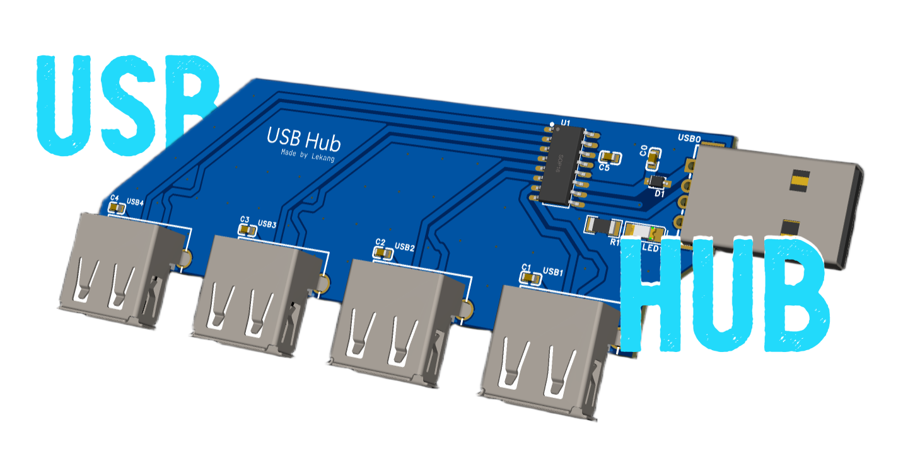

# USB-Hub

A **4-port USB 2.0 hub** designed with EasyEDA and the SL2.1A microcontroller. This project was created to learn PCB design while building something practical.

---

## Features

* **4 USB-A ports** with data + power for each (USB 2.0)
* **Power LED indicator**
* **Matched differential pairs (D+/D−)** for reliable USB 2.0 signals

---

## Project Overview

This project was my first experience with PCB design software. My goals were:

1. Learn PCB design and EasyEDA workflow
2. Build something useful: a small USB hub (used this [tutorial](https://jams.hackclub.com/tag/pcb))

---

## Files Included (all located in the `pcb/` directory)

* **Gerber files** (for PCB fabrication)
* **Pick and Place file** (for assembly)
* **BOM.csv** (Bill of Materials)
